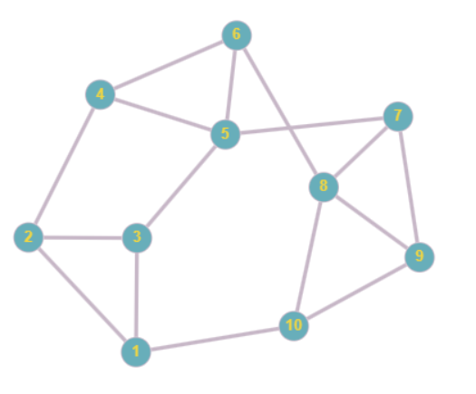

# Mean consensus (homework)
Проект по мулитиагентным системам: реализовать распределённый алгоритм average-consensus с использованием SPADE. Каждый агент хранит свое значение и имеет возможность обмениваться значениями с соседями и обновлять своё значение. Цель — вычислить среднее арифметическое

### Пример работы программы

### Граф из примера

